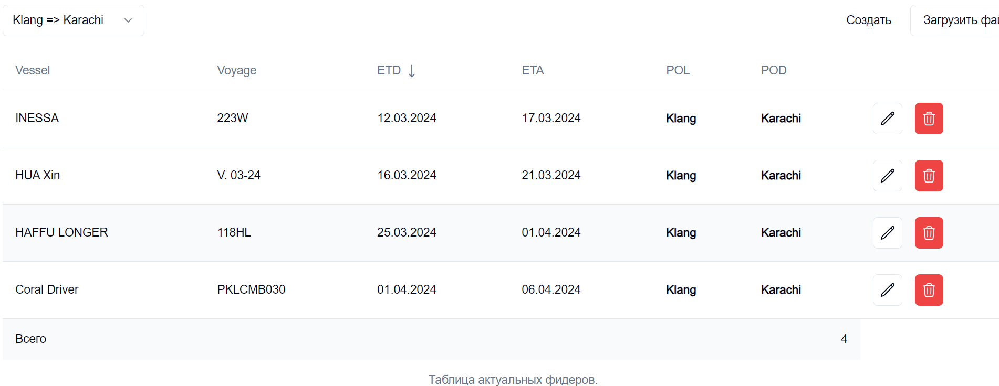
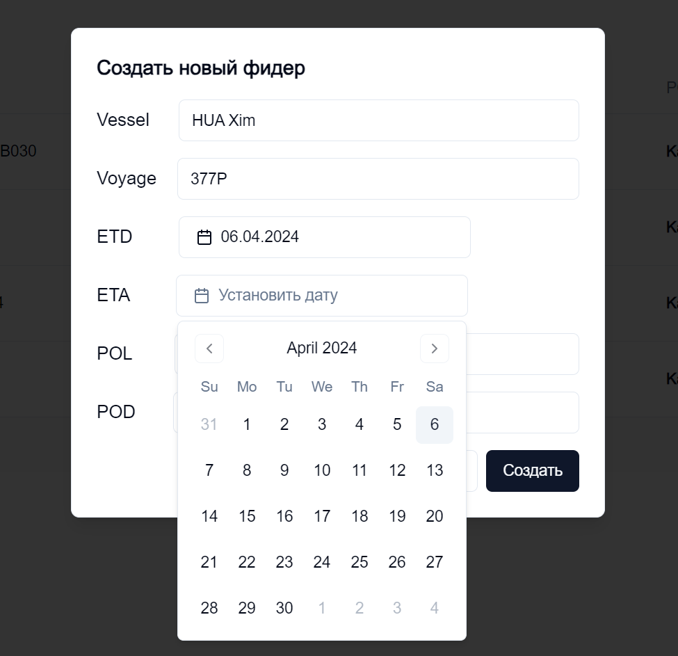

# Feeder dashboard

Пет-проект для логистической компании **Necoline**

Необходимо было выполнить сервис для мониторинга фидеров(судна третьей стороны, которые везут наш груз).

### Функционал проекта: 
- Сортировка по маршруту/дате
- Вход в админ мод по паролю
- Загрузка xls/xlsx файло с новыми фидерами
- Манульное создание новых фидеров
- Редактирование существующих фидеров
- Удаление фидеров

#### Стэк: 
Next.js 14 + TailwindCSS + PrismaORM 

Статус проекта: препродакшн.

##### Вид на админ панель


##### Создание фидера(использовал shadcn/ui)


Для запуска:

```bash
npm run dev
# or
yarn dev
# or
pnpm dev
# or
bun dev
```

